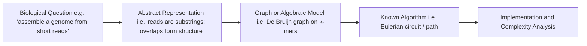

# Rosalind: A Programmer's Exploration in Biology

*Part 0 of an ongoing series solving Rosalind problems.*

Something I didn't expect when I started looking into Rosalind problems is that most of the problems were related to algorithms I already knew. This series documents the process of learning biology-inspired problem solving through [Rosalind](http://rosalind.info).

### What is Rosalind?

Rosalind is a problem platform built around bioinformatics. Each problem being related to a real biological idea, but the actual task is about doing something computational: counting, finding a pattern, computing a score, etc. The problems get progressively harder, with some requiring genuine algorithmic sophistication. Usually, one only needs enough biology to understand what the problem is asking.

> *Usually that's not much, but it matters!*

#### Why It's Algorithmically Interesting

What makes these problems interesting is how naturally they can be reduced to canonical algorithmic problems. The reductions are not always obvious, which makes them satisfying to find. A few examples:

- Genome assembly from short reads becomes an Eulerian circuit problem. You represent $k$-mers as edges in a De Bruijn graph, and reconstruct the genome by finding a path that uses every edge exactly once.

- Sequence alignment is edit distance extended with a substitution matrix encoding how biologically similar two amino acids are. The DP recurrence is structurally almost identical to LCS.

- Building phylogenetic trees from sequence data often involves variants of minimum spanning trees or shortest paths on distance matrices.

> Do not get scared if you do not understand the terms used here. You may always revisit these notebooks as we proceed.

Here's the conceptual pipeline we will try to follow for each problem:



#### Example: Mortal Fibonacci Rabbits

Rosalind's *FIBD* problem asks:

> Starting with one rabbit pair, where each pair produces one new pair per month starting at month 2, and each pair dies after $m$ months, how many pairs are alive after $n$ months?

The recurrence is:

$$
f(n) = f(n-1) + f(n-2) - f(n-m)
$$

New births follow the standard Fibonacci pattern. Deaths subtract off cohorts that have aged out.

```python
def mortal_rabbits(n, m):
    f = [0] * (n + 1)
    f[1] = 1

    for i in range(2, n + 1):
        f[i] = f[i-1] + f[i-2]

        if i > m:
            f[i] -= f[i-m-1]

    return f[n]
```

If you are already experienced in programming, then you have all of the tools required for solving these problems. However, for those who have their background in biology, any programming related information is going to be presented at the beginning of each article.

#### What You Should Know Before Reading

*(Biology knowledge is not required.)* I will try to start every problem by introducing just enough biology to make sense of the computational problem and understand its importance.

On the algorithmic side, it helps to be comfortable with:

- Complexity analysis: knowing when $O(n^2)$ matters and when it does not.
- Basic string algorithms and data structures.

Python will be the default language here. C++ will appear when performance actually matters or when advanced data structures become important.

> [!Note] A Note on Using AI Tools: I occasionally use Claude and ChatGPT during this work, mostly for formatting LaTeX, polishing explanations after I've already figured something out, generating boilerplate, and fixing markdown. The algorithmic reasoning, the structure of the solutions, and the process of working through the problems are my own. Else, it wouldn’t be that interesting for me either!

### Long-Term Plan

The plan is to go through almost all of Rosalind in curriculum order, except for skipping forward when anything particularly interesting pops up. I'll also try link older notebooks when similar algorithms come up again. This is supposed to be more like a study series for technical folks than a textbook. Some of the notes will not be perfect. Sometimes, a connection may become obvious only in retrospect.

*Next: Nucleotide counting and string problems.*